# TodoPomodoro 应用需求分析文档

## 一、项目概览

### 1.1 项目目标

结合待办事项(Todo)、番茄工作法(Pomodoro)和日历(Calendar)的效率管理应用。

### 1.2 系统架构图

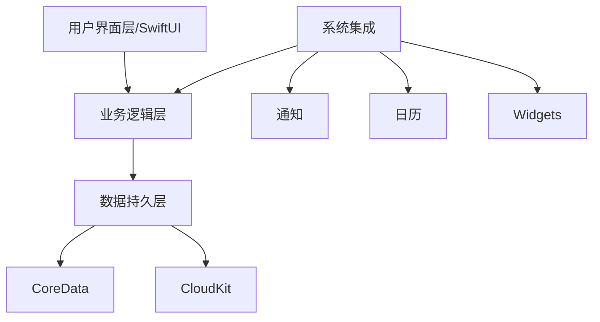

### 1.3 核心功能关系

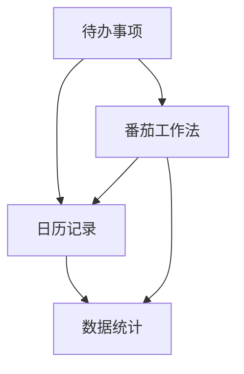

## 二、详细需求分析（按开发计划）

### 第一阶段：基础框架搭建（Day 1-10）

#### Day 1-2：项目初始化

##### 需求描述：

1. 项目创建与配置

   - 创建 Xcode 项目
   - 配置开发环境参数
   - 设置项目基础结构

2. Git 版本控制

   - 初始化 Git 仓库
   - 配置.gitignore
   - 创建首个提交

3. CoreData 配置

   - 创建数据模型文件
   - 配置基础实体
   - 设置持久化存储

4. TabView 结构
   - 实现基础标签页导航
   - 配置页面占位符
   - 测试导航功能

##### 验收标准：

- [ ] 项目能够成功编译运行
- [ ] Git 仓库正确配置
- [ ] 基础 TabView 可以正常切换
- [ ] CoreData 环境配置完成

#### Day 3-4：数据模型设计

##### 需求描述：

1. Todo 实体设计

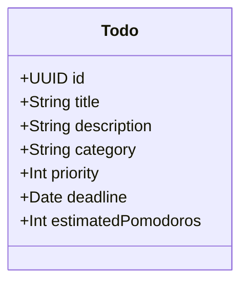

2. PomodoroSession 实体设计

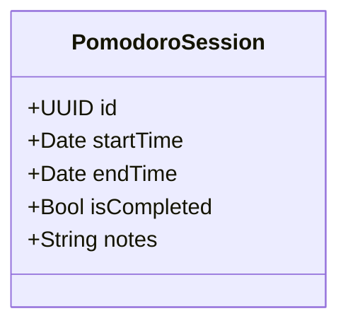

3. CalendarEvent 实体设计

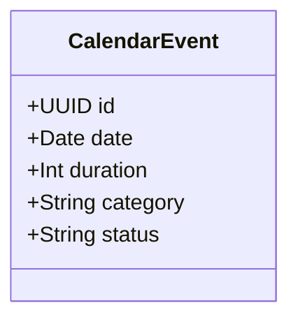

##### 实体关系：

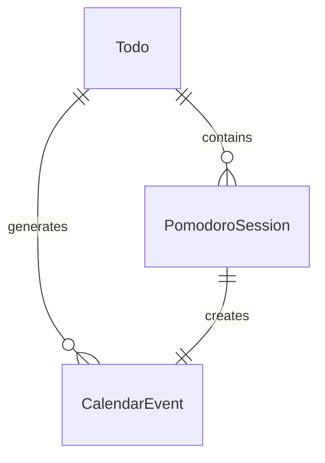

##### 验收标准：

- [ ] 所有实体完成设计
- [ ] 实体关系正确建立
- [ ] 可以进行基础 CRUD 操作
- [ ] 数据模型版本控制配置完成

#### Day 5-7：基础 UI 搭建

##### 需求描述：

1. 主页面框架

   - 实现主页面布局
   - 创建基本导航结构
   - 设计并实现基础主题样式

2. 可复用组件
   - TodoItem 视图组件
   - PomodoroTimer 组件
   - CalendarView 组件
   - 通用按钮和输入框

##### 界面流程：

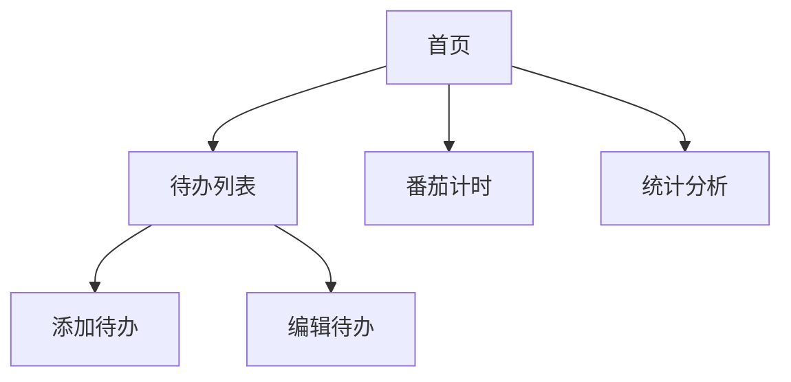

##### 验收标准：

- [ ] 所有基础页面可访问
- [ ] 组件样式统一
- [ ] 导航逻辑正确
- [ ] 基础交互正常

#### Day 8-10：数据持久化

##### 需求描述：

1. CoreData 管理器

   - 实现 CRUD 操作
   - 错误处理机制
   - 数据验证逻辑

2. iCloud 同步
   - 配置 CloudKit
   - 实现数据同步
   - 处理冲突情况

##### 数据流程：

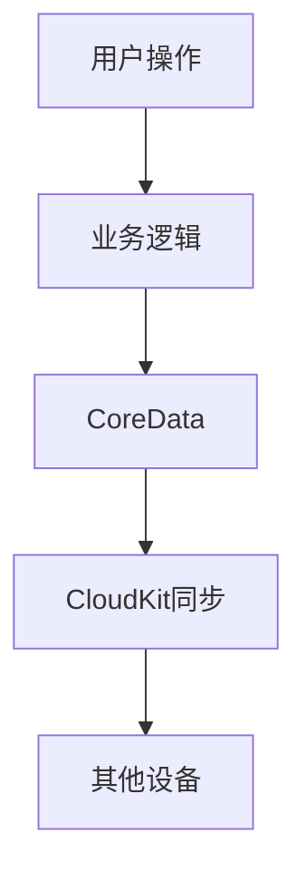

##### 验收标准：

- [ ] CRUD 操作正常
- [ ] iCloud 同步功能正常
- [ ] 数据一致性保证
- [ ] 错误处理完善

### 第二阶段：核心功能开发（Day 11-30）

#### Day 11-15：待办事项功能

##### 需求描述：

1. 待办事项列表

   - 实现列表视图
   - 支持分类显示
   - 支持排序功能
   - 实现搜索功能

2. 待办事项管理
   - 添加新待办
   - 编辑现有待办
   - 删除待办
   - 标记完成状态

##### 功能流程：

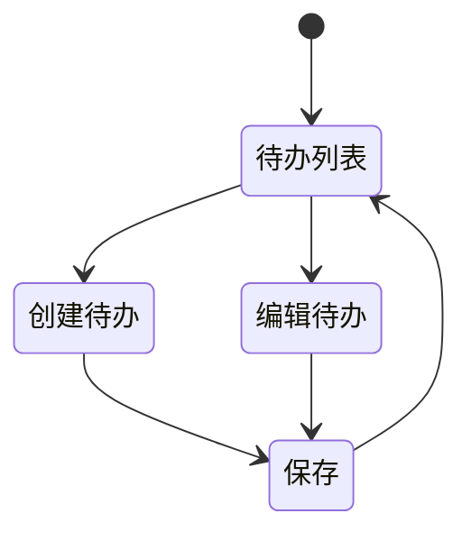

##### 验收标准：

- [ ] 待办事项 CRUD 功能完整
- [ ] 列表显示正常
- [ ] 搜索功能可用
- [ ] 分类和排序正确

#### Day 16-20：番茄工作法功能

##### 需求描述：

1. 计时器核心功能

   - 25 分钟工作时间计时
   - 5 分钟休息时间计时
   - 每 4 个番茄后 15 分钟长休息
   - 中断处理机制

2. 通知系统
   - 工作时间结束提醒
   - 休息时间结束提醒
   - 中断提醒
   - 自定义提醒声音

##### 工作流程：

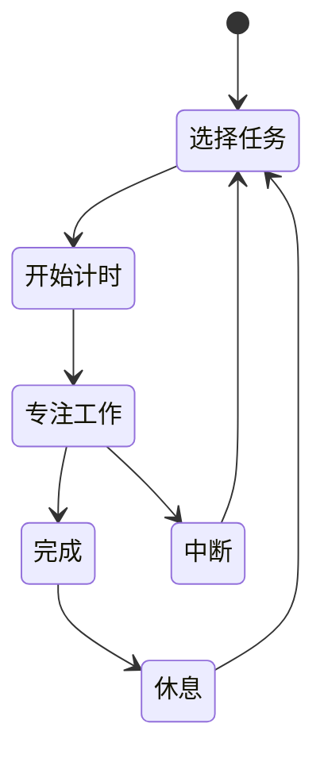

##### 验收标准：

- [ ] 计时器准确性
- [ ] 通知提醒及时
- [ ] 中断处理合理
- [ ] 数据记录完整

#### Day 21-25：日历集成

##### 需求描述：

1. 日历视图

   - 月视图实现
   - 周视图实现
   - 日视图实现
   - 时间线显示

2. 事件管理
   - 自动同步到系统日历
   - 支持自定义事件
   - 支持重复事件
   - 支持提醒设置

##### 数据流程：

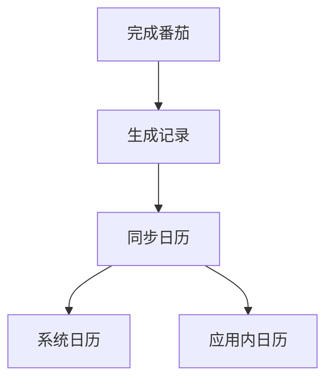

##### 验收标准：

- [ ] 日历显示正确
- [ ] 同步功能正常
- [ ] 事件管理完整
- [ ] 提醒功能可靠

#### Day 26-30：统计分析功能

##### 需求描述：

1. 数据统计

   - 完成任务统计
   - 番茄时间统计
   - 中断原因分析
   - 效率趋势分析

2. 可视化展示
   - 日/周/月统计图表
   - 分类占比饼图
   - 完成率曲线图
   - 自定义报告

##### 数据展示：

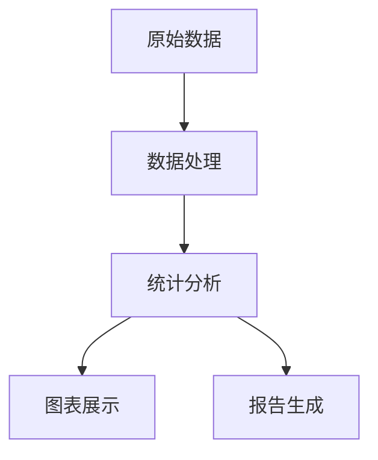

##### 验收标准：

- [ ] 统计数据准确
- [ ] 图表显示清晰
- [ ] 分析结果有效
- [ ] 报告导出功能

### 第三阶段：高级功能开发（Day 31-50）

#### Day 31-35：Widget 开发

##### 需求描述：

1. 小组件功能

   - 待办事项展示
   - 当前番茄状态
   - 今日完成统计
   - 快捷操作支持

2. 不同尺寸支持
   - 小尺寸 Widget
   - 中尺寸 Widget
   - 大尺寸 Widget
   - 自适应布局

##### 数据更新流程：

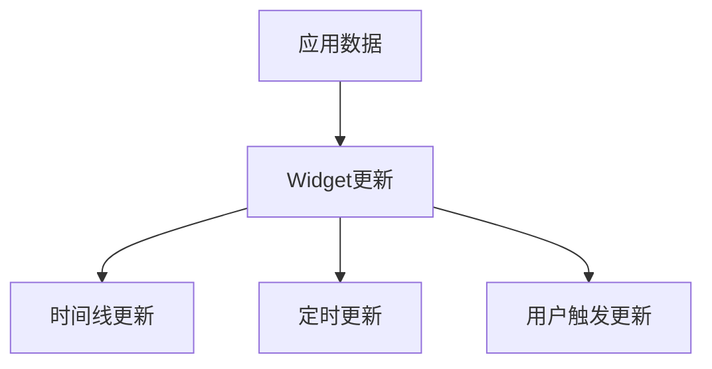

##### 验收标准：

- [ ] Widget 显示正常
- [ ] 数据更新及时
- [ ] 交互响应快速
- [ ] 内存占用合理

#### Day 36-40：快捷指令集成

##### 需求描述：

1. Shortcuts 支持

   - 创建待办快捷指令
   - 开始番茄快捷指令
   - 查看统计快捷指令
   - 自定义场景支持

2. 语音命令
   - Siri 集成
   - 语音创建待办
   - 语音控制番茄
   - 语音查询统计

##### 功能流程：

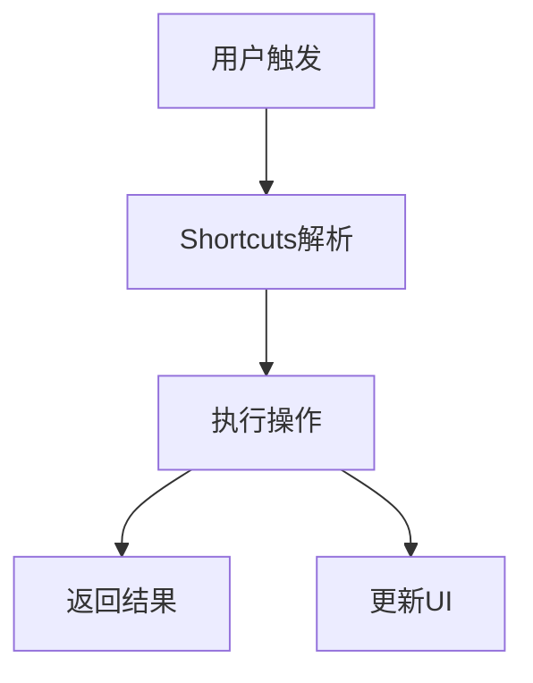

##### 验收标准：

- [ ] 快捷指令可用
- [ ] 语音命令准确
- [ ] 响应速度快
- [ ] 操作结果正确

#### Day 41-45：系统集成增强

##### 需求描述：

1. Focus Mode 集成

   - 自动开启专注模式
   - 自定义专注设置
   - 场景联动
   - 通知过滤

2. Live Activities
   - 番茄计时显示
   - 进度更新
   - 动态岛支持
   - 锁屏显示

##### 系统集成：

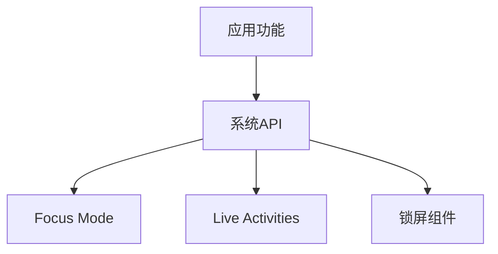

##### 验收标准：

- [ ] Focus Mode 正常
- [ ] Live Activities 流畅
- [ ] 系统集成稳定
- [ ] 用户体验良好

#### Day 46-50：跨平台适配

##### 需求描述：

1. iPad 适配

   - 分屏支持
   - 键盘快捷键
   - Apple Pencil 支持
   - 大屏优化

2. Mac 版本
   - 菜单栏设计
   - 键盘快捷键
   - 通知中心集成
   - 原生体验

##### 适配流程：

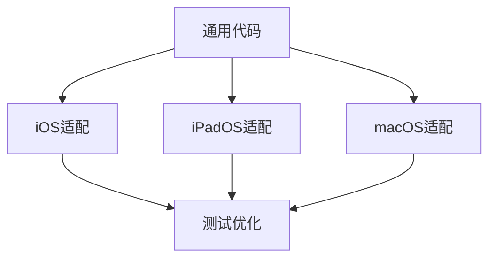

##### 验收标准：

- [ ] iPad 体验优化
- [ ] Mac 功能完整
- [ ] 数据同步正常
- [ ] 性能表现好

### 第四阶段：优化和完善（Day 51-60）

#### Day 51-55：性能优化

##### 需求描述：

1. 性能优化

   - 启动时间优化
   - 内存使用优化
   - 电池消耗优化
   - 网络请求优化

2. 同步机制优化
   - 冲突处理优化
   - 同步效率提升
   - 离线支持增强
   - 数据一致性保证

##### 优化指标：

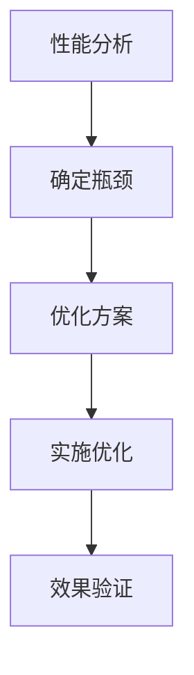

##### 验收标准：

- [ ] 启动时间达标
- [ ] 内存占用合理
- [ ] 电池消耗适中
- [ ] 同步体验流畅

#### Day 56-60：用户体验完善

##### 需求描述：

1. UI/UX 优化

   - 动画效果优化
   - 交互流程优化
   - 视觉体验提升
   - 无障碍支持

2. 错误处理
   - 错误提示优化
   - 恢复机制完善
   - 用户引导优化
   - 帮助文档完善

##### 优化流程：

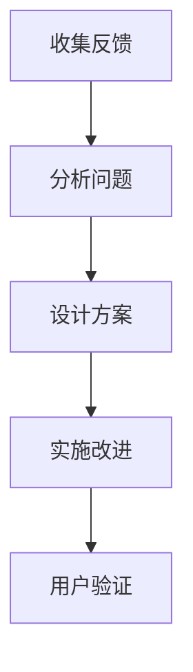

##### 验收标准：

- [ ] 动画流畅
- [ ] 交互自然
- [ ] 错误处理完善
- [ ] 用户反馈正面

## 三、技术规范

### 3.1 开发环境要求

- Xcode 14.0+
- iOS 16.0+
- macOS Ventura+
- Apple Developer 账号
- iCloud 开发环境

### 3.2 代码规范

- Swift 风格指南遵循
- SwiftLint 配置
- 文档注释要求
- 代码审查标准

### 3.3 测试要求

1. 单元测试覆盖率 > 80%
2. UI 测试覆盖主要功能
3. 性能测试标准
4. 集成测试要求

### 3.4 发布标准

1. 代码质量要求
2. 性能指标要求
3. 用户体验标准
4. 安全性要求

## 四、风险评估

### 4.1 技术风险

1. 数据同步冲突
2. 后台计时器可靠性
3. 系统日历集成限制
4. 电池消耗优化
5. 跨设备体验一致性

### 4.2 解决方案

1. 实现冲突解决策略
2. 优化后台进程
3. 实现降级方案
4. 性能优化方案
5. 兼容性测试方案
